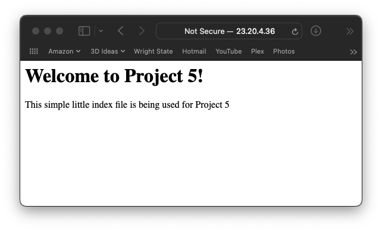
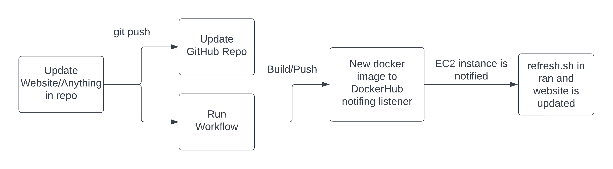

# Project 5
I am completing this project with an EC2 instance.
## Part 1 - Dockerize it
- How to install Docker: ([Source](https://www.simplilearn.com/tutorials/docker-tutorial/how-to-install-docker-on-ubuntu))
```
1. sudo apt-get remove docker docker-engine docker.io
2. sudo apt-get update
3. sudo apt install docker.io
4. suo snap install docker
5. docker --version
6. sudo docker run hello-world
```
- How to build the container:  
`sudo docker build -f Dockerfile -t website`  
Dockerfile is the name of the file being used to build the image  
website is the name of the image  

- How to run the container:  
`sudo docker run --name webserv -p 8080:80 website`  

- How to view the project running:  
Go to web browser on local host and go to: `http://ip:port` in my case it would be `http://23.20.4.36:8080`
  

## Part 2 - GitHub Actions and DockerHub
- Process to create public repo in DockerHub  
Once at hub.docker.com and signed in, click Create repository>add a name (in my case I did ceg3120)>make sure Public is selected>create
- How to authenticate with DockerHub via CLI using DockerHub credentials  
    1. Use this command: `sudo docker login -u username` so in my case it would be `sudo docker login -u dylansteinke`  
    2. Then enter your password correctly.  
  
    Instead of using a simple username and password, I would recoommend using an Access Token to signin instead. By doing this, we also will not have to worry about the password being stored in a file anywhere like we do with the username and password method. With this case, a new token is created on DockerHub, then copied as the password to be used for the CLI for example instead of the users password.  
- How to push container to DockerHub  
    1. Use this command to build the image: `sudo docker build -t username/repo` so in my case `sudo docker build -t dylansteinke/ceg3120` . 
    2. Then push to dockerhub using: `sudo docker push username/repo` so in my case `sudo docker push dylansteinke/ceg3120`  
- Configuring GitHub secrets  
    I created two secrets, one which was my username and one which was my password  
    Username: `DOCKER_USERNAME`  
    Passowrd: `DOCKER_TOKEN`  
- Behavior of GitHub workflow  
    The GitHub workflow that was created checksout the proper branch on Github, logs into DockerHub using my username/token, setsup Buildx, builds the image, then pushes it to Dockerhub.  
    The variables that needed to be changes were the repository, the username secret, and the password/token secret.  

## Part 3 - Deployment
- Description of container restart script  
    1. We stop the conatiner from running  
    2. We remove the container to open up the ports  
    3. We pull the latest image from dockerhub  
    4. We start the new image into a container  

- Setting up webhook on the server  
    I created the listener by watching lecure videos and running commands from lectures to verify it was running. On a second terminal after starting the following steps, I verified it was running by using this command: `lsof | grep LISTEN`

    I used the following steps to install and run webook:  
    1. `export PATH=$PATH:/usr/local/go/bin`  
    2. `wget https://go.dev/dl/go1.19.3.linux-amd64.tar.gz`  
    3. `sudo tar -C /usr/local -xzf go1.19.3.linux-amd64.tar.gz`  
    4. `go install github.com/adnanh/webhook@latest`  
    5. `go build github.com/adnanh/webhook@latest`  
    6. `/home/ubuntu/go/bin/webhook -hooks /home/ubuntu/cicd-3120-dylansteinke/hooks.json -verbose`  
- Description of Webhook task definition file  
    The definition file has an ID that dockerhub will use at the next step and uses the inforamtion in the file to run this automation. It looks at the execute-command line to see which file to run/use and then the working directory to see where the files should be stored when ran. (kidna like a temp file/folder).
- Steps to set up a notifier in GitHub or DockerHub  
    1. Go to Webhooks in the repo  
    2. Enter a webhook name (in my case it is: Deploy new image)  
    3. Enter the webook URL (in my case it is: http://23.20.4.36:9000/hooks/pizza)

## Part 4 - Diagramming
  
